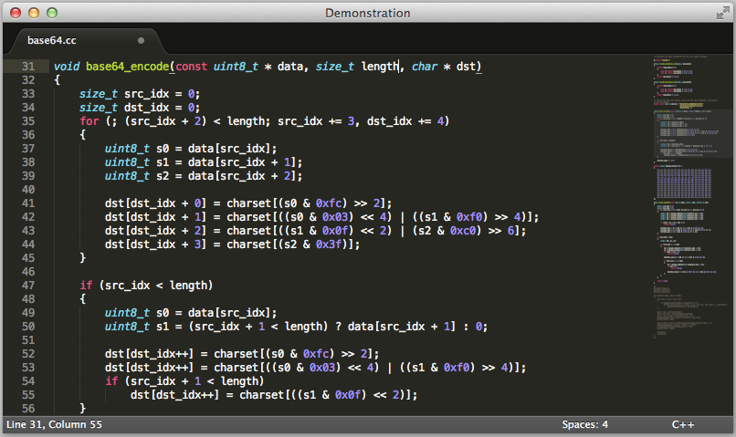
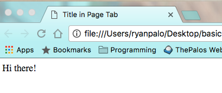
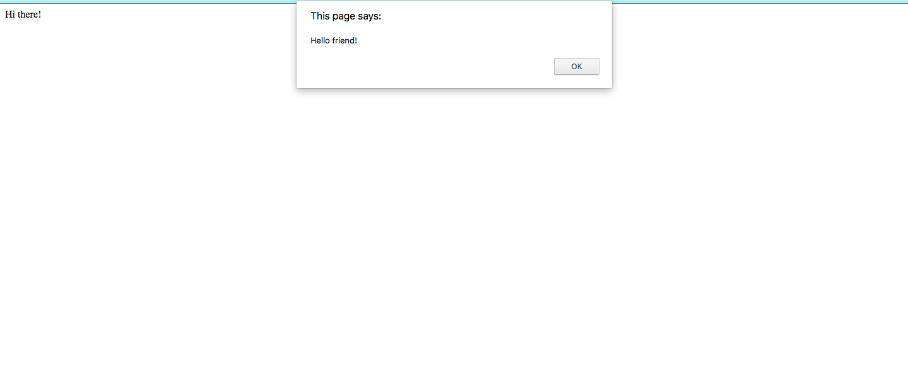
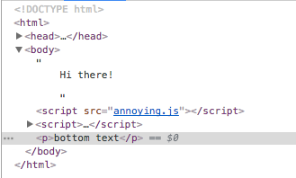
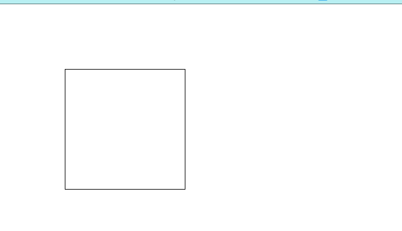
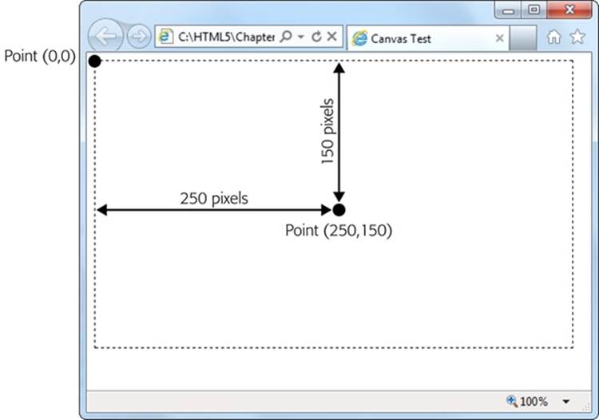
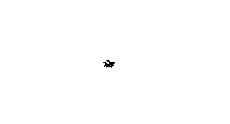

# Lesson 1: Random Walker

The first lesson will cover setting up a project, a quick flyby of HTML and JS and how they fit in together, setting up the "Dev Environment" (text editor and browser, no packages), and getting into it.  To cap everything off, we'll build a random walker in two dimensions.

## Step 1: The Setup

There's a few things we'll need to get started: a browser (probably check) and a text editor (we'll use [Sublime Text](https://www.sublimetext.com/) just to get started).



Go ahead and get those installed.  I won't insult you by telling you how to install a program.

## Step 2: HTML/JS Flyby

Let's talk a little about HTML.  We won't need to know much right away.  Just a little bit.  The first thing to know is that all websites are made up of files that are just text.  In general, the layout of a web page is defined in a text file ending in `.html` that contains a special langage and format.  HTML is short for Hyper Text Markup Language, but all that really means is it's text that written in such a way that a browser can read and parse it and convert it into a pretty, rendered format.  I'm going to talk more about the specifics now, but it's super important that you don't try to memorize HTML.  There are so many little rules and options to remember that trying to memorize everything in one go will definitely overwhelm anybody.  I would recommend just picking up the conceptual nuggets and letting the rest wash over you, picking things up organically as you go.  As you use it more and more, you'll find yourself remembering more and having to Google less.  Leggo.

### The Super Basics

HTML is made up of building blocks called **elements** that look like this:

```html
<p>
  Hi there!  'p' stands for Paragraph!
</p>
```

Each **element** is defined by its **tags** which are the things in angle brackets (<>).  Some **elements** have an opening and closing **tag**, like the one shown above.  This is so that these elements can wrap around the outside of other elements, creating this nested hierarchy that will come in handy much later.  Some elements are "self-closing", so you don't need a second one.  One example is the `<hr>` element, that makes a "horizontal rule" or line accross the page.  Since it's really hard to put anything *inside* a line, it makes sense to have that as a self-closing tag.

### Structural Tags

There are a few tags that make up the foundation of every page.  Every page should have at least this:

```html
<!doctype html>
<html>
  <head>
    <title>Title in Page Tab</title>
    <!-- This is how we comment.  Nobody sees this -->
  </head>
  <body>
    Hi there!
  </body>
</html>
```

1. `<!doctype html>`: This tells the browser it's looking at an HTML file, and what version of HTML we're using, based on the format.  This simplified format means we're using the most recent version: HTML5.
2. `<html>`: These tags contain all the rest of our html.  Nowadays, you can even leave these off and the browser is smart enough to figure out what you mean, but it's best to make sure you have this anyways.
3. `<head>`: This section doesn't show up on the page.  It is a header that contains many of the settings and information that the browser, search engines, devices, and other internet things need to interact with your web page.  Once we get there, we'll put our links to **stylesheets** there, to make our pages look pretty.
4. `<body>`: This is where the meat of your page goes.  Everything in the body will exist on your webpage.  Our if you were to save the above snippet as `basic.html` and double-click it to open it, you would see this:



One other thing to pay attention to is how we were able to nest the `head` and `body` tags inside the `html` tags, and we even nested the `title` tag inside the head!  Each webpage is a tree-like hierarchy like this that can sometimes get really, really nested.  Also note that it's considered best practice to indent your tags to the same lines (each nesting indented 2-4 spaces) to make it easier to read.

### Adding in Scripts

Now, we'll add in the scripts that will allow us to use deeper programming concepts like **variables**, **loops**, and more!  There's a special tag called a `script` tag that loads files such as **JavaScript** files.  **JavaScript** is the current internet standard for adding code functionality to your web page.  

> Before we go any further, I just want to make a note.  This is directed at anyone with lots of programming experience that reads this.  Throughout the next few examples, we will cover some code that may not exactly be "best practice" or "industry standard".  That's not what I'm trying to do here.  I'm just trying to get some code that is easy to understand and works.  For instance, AirBnB's JavaScript style guide recommends defining functions like this: `var foo = function bar() {};`.  They provide good reasons for why you should do it this way.  It makes a lot of sense.  BUT.  You have to have a good amount of background before that's the case.  For someone just starting out, it makes a lot more sense to do it the way we'll do it below.  So all you smarty farties that want to correct: leave it alone for now.  There will be time for that later.

JavaScript works like this.  Imagine you have the `basic.html` file from above in your current directory.  Who knows, maybe you really do!  Next, create a file in the same directory called `annoying.js`.

```javascript
// This is how we comment in JavaScript
// Why are they all different?  Who knows.

var message = "Hello friend!";
alert(message);
```

Be sure not to forget your semicolons at the end of each line.  JavaScript is slowly (hopefully) moving away from needing the semicolons, but for now, we're stuck with them.  I'm sure we'll talk more about the history and progress of JavaScript later.  For now, let's add a line to our `basic.html`.

```html
<!doctype html>
<html>
  <head>
    <title>Title in Page Tab</title>
    <!-- This is how we comment.  Nobody sees this -->
  </head>
  <body>
    Hi there!
    
    <script src="annoying.js"></script>
  </body>
</html>
```

Save the file and either re-open it in your browser, or, if you've already got it open, click refresh.



Look at you!  You've now learned exactly as much as the annoying, good-for-nothing spam website creators know.  `alert("Your computer may have a virus!");`  Ha.  Ha.

Just to finish explaining, the `src=` portion of the `script` tag tells the browser where to look for the file to load.  If you wanted to, you could have omitted that `src=` portion and just put the code in between the `script` tags.  Anything you put in between those tags is assumed to be JavaScript.  I'm going to show you an example that is cool.  Don't worry if it doesn't make total sense yet.

```html
<!doctype html>
<html>
  <head>
    <title>Title in Page Tab</title>
    <!-- This is how we comment.  Nobody sees this -->
  </head>
  <body>
    Hi there!

    <script src="annoying.js"></script>
    <script>
      var bt = document.createElement('p');
      bt.innerHTML = "bottom text";
      document.body.appendChild(bt);
    </script>
  </body>
</html>
```

In a short explanation, I create a new "paragraph" element, like we saw above.  I set the text inside that `<p>` element to be `"bottom text"`, and then I attach it to the bottom of the `body` tag.  If you right-click the page and click `inspect`, you should see some HTML, but there's a new `<p>` element sitting there at the bottom that we didn't have in our `basic.html` file!



Cool right?  OK, I think we know as much as we need to move forward.

## Step 3: Introducing P5

With JavaScript (and pretty much any other programming language), you can load in and build on top of other people's work.  This is great!  This is great because otherwise, everyone who wanted to make something would have to write all of the supporting/utility/framework-ey code as well.  There would be a billion people all writing libraries that helped capitalize words and take the square root of things.  The way you load in an external library is by including the relevant `script` tag before the `script` tags for your own code.  Since HTML files are read and processed from top to bottom, the `script` tags that come first get loaded first and become available for your code to reference.

One other thing to note.  Before, we showed that you can include your code in between the `script` tags, like this: `<script>alert("Woohoo!");</script>`.  We also showed that you can load a local file like this: `<script src="path/to/the/file.js"></script>`.  What I didn't include is that the `src` can also be a path to a website, so you can load the file from the web!  This is one easy way to load external libraries without having to download a bunch of files or keep track of them.

Enter: P5.js.  P5 is an animation library, with a really easy interface that is based on an earlier project called [Processing](https://processing.org/).  You can go to the [P5.js homepage](https://p5js.org/) for more info, examples, and documentation.  We'll do more with that later.  I'll show you the basics with a second example.  Create a new folder called `example2` and create a file called `index.html` inside it.  (More on why it's called `index` later, because that's important-ish).  Also create a file called `sketch.js`.  Here's your `index.html`.

```html
<!doctype html>
<html lang="en">
  <head>
    <title>My First P5.js Sketch!</title>
  </head>
  <body>
    
    <!-- This is the external P5 library we're loading  -->
    <script src="https://cdnjs.cloudflare.com/ajax/libs/p5.js/0.5.14/p5.js"></script>
    <!-- Here's the link to our script -->
    <script src="sketch.js"></script>
  </body>
</html>
```

That's it!  This will actually be the starting point for pretty much all of your projects, so feel free to save this file somewhere you can copy it from later as a starting point.  Let's take a look at your `sketch.js` file.

```javascript
function setup() {
  createCanvas(600, 400);
}

function draw() {
  background(255);
  stroke(0);
  fill(255);
  rect(100, 100, 200, 200);
}
```

There's a lot of new things there that we should talk about.

### Functions


In programming, the computer reads the code line by line from top to bottom.  (There are some things that happen that are exceptions to that, but that's not important now.)  You could, in theory write every instruction one after another, typing everything out.  However, **functions** are blocks of code that we can reuse.  We'll talk about the benefits of doing this as we go.  You can think of functions like a combination of microwave presets and math functions.  

### Microwave Presets

When you push Quick Minute on your microwave, it turns the light on, starts the turntable, activates the microwave, puts 1:00 on the timer, and begins counting down.  Once it gets to 0:00, it turns the microwave off, turns the light off, stops the turn table, and beeps.  If it's one of those horrible microwaves, it beeps every 15 seconds after that until someone opens the door.  Can you imagine having to push one or more buttons for each of those steps?  Isn't it so much nicer to push Quick Minute?  If the manufacturer wanted to add a step that starts a disco ball inside the microwave, they could just add that line to the Quick Minute function instead of making you remember to add that in everytime you pushed the button sequence.  It might look something like this in JavaScript.

```javascript
function quickMinute() {
  lightOn();
  turnTableOn();
  microwaveOn();
  cook(1.0);
  microwaveOff();
  turnTableOff();
  lightOff();
  beep();
  // beepUntilOpened();
}
```

Functions in JavaScript are defined by the word `function`, a name (in this case: `quickMinute`), any function inputs in parenthesis (in this case: there are none), and then the code in the function within the {} brackets.  You can then call this function whenever you want by simply typing the name of the function and a pair of parenthesis () like this:  `quickMinute()`.  

### Math Functions

Functions can take input and produce output as well!  Remember the parenthesis?  You can put names for the things that you expect inside them.  You can output a value with the word `return`.  Watch:

```javascript
function multiply(a, b) {
  return a * b;
}
```

Then, if you **call** the function (call means run) with inputs, you'll get outputs as expected.

```javascript
multiply(3, 4);
// => results in 12!
```

But be careful!  It's up to you to name things in a way that makes sense.  Take a look at this misleading function:

```javascript
function misleadingMultiply(a, b) {
  return "Butt";
}
misleadingMultiply(3, 4);
// => 'Butt'
```

This is one of the responsibilities of a good programmer!  Okay!  Back to the `sketch.js` code.

### Setup and Draw

P5.js expects two main functions to be defined by you.  `setup` is run once, right at the beginning, by P5.  It's a good place to set things up.  `draw` is run repeatedly, over and over, after that.  Currently we're not making use of that, but we'll do it in the final project in this lesson.  Let's look at the `setup` and `draw` that we defined above.

```javascript
function setup() {
  createCanvas(600, 400);
}
```

P5 animations (also called **sketches**) occur on a canvas (which is a special HTML element that you can draw shapes on).  The easiest way to do that is via  function provided by P5, called `createCanvas`.  You just have to tell it a width and a height (in pixels).  In our example, we made it 600 wide and 400 tall.  That's all the setup we did for this one!

Next is `draw`.

```javascript
function draw() {
  background(255);
  stroke(0);
  fill(255);
  rect(100, 100, 200, 200);
}
```

Every loop, we redraw the background with the `background` function.  There are several ways to call this function, but this way is with a number between 0 and 255 (I'll explain the significance of that number later).  0 is full black, and 255 is full white.  That means that we're drawing a white background.  Next, we set the stroke or pen color for the edges of our shapes.  You can see that we're setting it to be black.  After that, we set the fill color for our shapes to white.  Lastly we actually draw a rectangle.  When you draw a rectangle, you call it with `(x-position, y-position, width, height)`.  How do I know what numbers are needed in parenthesis?  I'm magic and know everything.  Also, it's on their website.  Check out their [documentation for the `rect` function](https://p5js.org/reference/#/p5/rect).  Any time you have a question, start with the documentation.  There is a lot of good stuff there.  In fact, all four of these are functions provided by P5: [background](https://p5js.org/reference/#/p5/background), [stroke](https://p5js.org/reference/#/p5/stroke), and [fill](https://p5js.org/reference/#/p5/fill) all have their own documentation as well!

Okay!  That about covers it!  Save your files and open up `index.html` in your browser!



**TADA!**  Aren't you so excited?!  After all of that, we made… a rectangle.  A square to be precise.  I hear you say: booooooo.  Okay smarty pants.  Let's move onto the main project for this lesson: The Random Walker.

## Project: The Random Walker

If you've stayed with me so far, it might be a good idea for you to take a break at this point and have a snack or something.  We're going to learn a lot in this project.  Here's a list of firsts you'll encounter:

- variables
- true and false
- comparing numbers
- doing math
- branching (i.e. if statements: if `something is true`, do one thing.  Otherwise do another)
- pixels and why things are upside-down

And that's it!  Stay tuned.  To get setup, create a folder called `project1` and inside that, copy your baseline `index.html` and create a new file called `sketch.js`.  I'm going to lay out the entire project code up front so you can see where we are going, and then I'll explain the parts one after another, much like I did in the last section.  Here's the code for your `sketch.js`.

```javascript
var x, y, rand;

function setup() {
  createCanvas(600, 400);
  x = width/2;
  y = height/2;
  stroke(0);
}

function draw() {
  rand = floor(random(4));
  if (rand === 0) {
    x++;
  } else if (rand === 1) {
    x--;
  } else if (rand === 2) {
    y++;
  } else {
    y--;
  }

  point(x, y);
}
```

Alrighty.  There's a lot here.  If you're a super genius, you can kind of get a sense of what's going on, but I'll explain it for the normal humans like me.

### Variables

```javascript
var x, y, rand;
```

We're declaring our variables up front.  A variable is like an address or mailbox slot that could hold a value.  You use the word `var` to tell JavaScript you want to create new ones.  If you're anything like me, you'll forget to write `var` all the time.  If you just write `var x` and not `var x = 3` or something, then then the value of `x` (at least until you assign something to it i.e. put a value in that particular PO box called `x`) will be the JavaScript concept `undefined`.  More on that later.  Hopefully right now you can see that we're saying right at the beginning, "Hey!  I'm going to have three values that I care about and want to get access to later: x, y, and rand."  Don't forget the semicolon at the end of the line!

### The Setup Function

```javascript
function setup() {
  createCanvas(600, 400);
  x = width/2;
  y = height/2;
  stroke(0);
}
```

There's not actually that much that is new here.  Hopefully you'll recognize `stroke` and `createCanvas` from the last example.  There's only two new things here:

One is that we are finally assigning our first values to `x` and `y`, using the single equals sign (=).  You can think of the single equals sign as an arrow that points to the left, saying, "Take whatever value you end up with on the right side of the equals and put it in the PO box named `x`."  P5 provides us with some handy variables `width` and `height` that contain the width and height of the canvas that we're working in.  Since we know we created it to be 600px wide and 400px tall, hopefully you can see that after this function gets run, the value of `x` is 300 and the value of `y` is 200.  I wanted to start exactly in the middle of the canvas.

### The Draw Function

```javascript
function draw() {
  rand = floor(random(4));
  if (rand === 0) {
    x++;
  } else if (rand === 1) {
    x--;
  } else if (rand === 2) {
    y++;
  } else {
    y--;
  }

  point(x, y);
}
```

There's a *lot* of new stuff in this function.  You can see we finally assign a value to `rand`, but what is it?  P5 provides two useful functions for us: [`floor`](https://p5js.org/reference/#/p5/floor), and [`random`](https://p5js.org/reference/#/p5/random).  The way that we're using `random`, it takes in an optional maximum value, and it returns a random value between zero and that maximum, noninclusive (i.e. [0, max), i.e. between 0 and 3.99999).  `floor` takes any number in and returns that number rounded down to the nearest number (e.g. 3.4 becomes 3 and 2.9 becomes 2).  All together, you are assigning a random choice of (0, 1, 2, 3) to `rand`.

#### Comparing Things

```javascript
(rand === 0)
```

There's a large section in this function that has 4 of these equations in parenthesis.  What the triple equals does in JavaScript is compares the two.  If the thing on the left is the same as the thing on the right, it evaluates to the JavaScript value `true`.  Otherwise it evaluates to false.

#### Branching with IF, ELSE IF, ELSE Statements

```javascript
  if (rand === 0) {
    x++;
  } else if (rand === 1) {
    x--;
  } else if (rand === 2) {
    y++;
  } else {
    y--;
  }
```

This is what is known as an **if statement**.  The way it works is by starting at the top.  **If** the first test in parenthesis evaluates to `true`, then the code within the brackets {} is run and nothing else is.  Otherwise, the code moves on to the next **if**.  If none of the **if** statements ends up being true, and there is an **else** statement present, that runs instead.  You can mix and match your **ifs** with **else ifs** and **elses** as you see fit:

```javascript
if (name === "Jim") {
  alert("Hi Jim!");
} else {
  alert("Hi stranger!");
}
```

No **if elses** is acceptable.

```javascript
if (age > 65) {
  alert("Here's your senior discount!");
} else if (age < 12) {
  alert("Here's your child's discount!");
}
```

No **else** is also acceptable.  If there's no else and, for example, `age` was 29, nothing would happen in the block of code above.

So, to bring us back to the code in our `draw` function, what we're doing is checking each possible value of `rand`.  If `rand` is 0, do this.  If `rand` is 1, do this.  If `rand` is 2, do this.  Otherwise (we know `rand` is 3), do this other thing.  In theory, only one branch will be run, depending on `rand`'s value.

#### Modifying Variables In-Place

```javascript
x++;
```

This is a short cut.  There's a couple of ways to modify variables in JavaScript.  You can do it the long-form way that you've seen before:

```javascript
x = 3 * 7;
```

You can even use the variable in both sides of the equation!

```javascript
x = 12;
x = x + 3;
// The right side evaluates to 15, so then
// x gets set to 15: x === 15
```

There's a shorthand to the method above:

```javascript
x = 12;
x += 3;
// x === 15, += is short for add the following
// to the current value of x
```

There's even a shorter shorthand if you want to just add 1 to the variable (i.e. increment it).  That's what you see above:

```javascript
x = 12;
x++;
// x === 13
```

#### Drawing Points

Lastly, there is a function provided by P5 called [`point`](https://p5js.org/reference/#/p5/point) that places a 1px dot at the provided `(x, y)` coordinates.  Speaking of which:

#### Canvas X and Y

In the browser, all points are referenced from Top and Left.  In fact, x and y are aliases for Top and Left, respectively.  Top is the number of pixels something is from the top of the window, and left is the number of pixels from the left side.  What this means is that X makes sense as x+ to the right, but Y is backwards from what you would assume.  Y+ is down, meaning that y = 10 is almost at the top of the screen and y = 100 is further towards the bottom.



Thus, in our code above, if `rand` is 0, we add 1 to `x`, causing the `point` to move right one.  If `rand` is 1, we subtract 1 from `x`, causing the `point` to move left one.  If `rand` is 2, we add 1 to `y`, thus causing the `point` to move down one.  And if `rand` is 3, we subtract 1 from `y`, causing the `point` to move up one.

### Wrapping Up

```javascript
var x, y, rand;

function setup() {
  createCanvas(600, 400);
  x = width/2;
  y = height/2;
  stroke(0);
}

function draw() {
  rand = floor(random(4));
  if (rand === 0) {
    x++;
  } else if (rand === 1) {
    x--;
  } else if (rand === 2) {
    y++;
  } else {
    y--;
  }

  point(x, y);
}
```

Putting it all together, remembering that `setup` gets run once and `draw` gets run over and over after that, our code starts with a `point` in the middle of the screen.  Every time we run through `draw` (known as one **animation frame** or **frame** for short), the `point` moves randomly in one of the four cardinal directions, and we re-draw the point.  Save your code and open up `index.html` in your browser!  If everything is right, you should see our little buddy noodling his way around the middle of the canvas.



Feel accomplished yet??  You should.  You did awesome!  (Awesomely?)  Here's some homework:

#### Homework

1. Try making our walker more active: make his steps larger.
2. Make it so our walker is biased towards the right side.  Make it so that he is equally likely to go up, down, or left, but slightly more likely to go right.  (Hint: try using < and > instead of ===).
3. Change our walker's color!  Now, change our walker's color every single frame.
4. Make our random walker's step size vary randomly by some amount.
5. Make it so that if our walker reaches the edge of the canvas, he/she gets teleported to the other side of the canvas.  (Hint: use a very small canvas to save time in testing).
6. Currently the walker's steps are preserved.  This is because we aren't redrawing the background every time.  Make it so that you can't see the walker's previous steps.  Now make it so you can't se the steps and the walker is moving around in a rave (i.e. random background color!).
7. Using the P5 documentation: instead of drawing a `point`, draw a circle.  Do something creative with the circle's fill color.